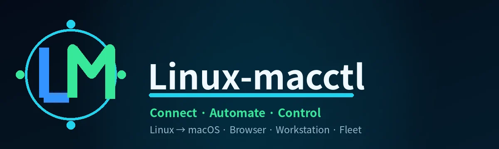
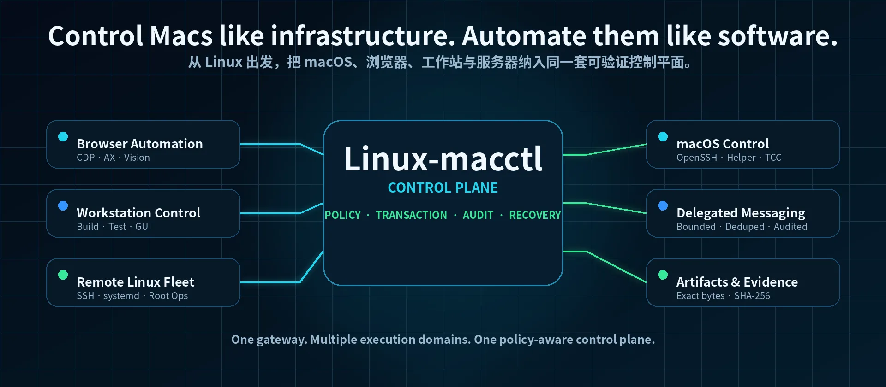
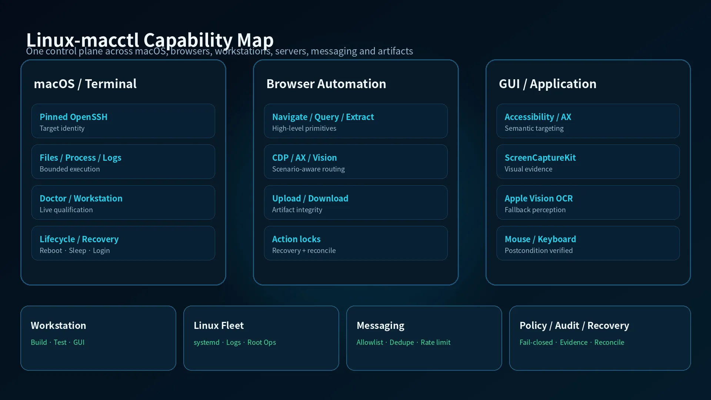
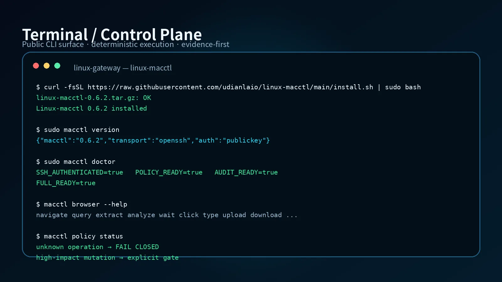
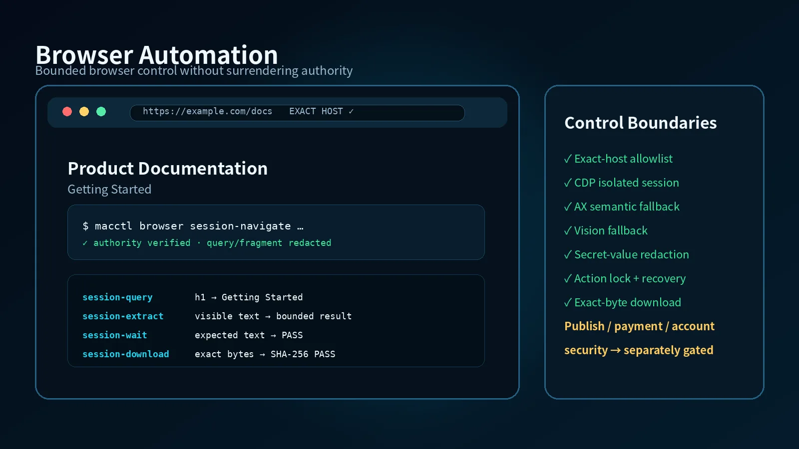
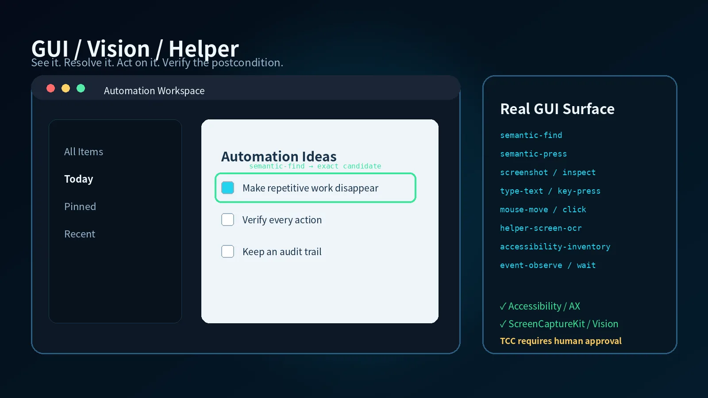

<div align="center">



<br>



<br>

# Linux-macctl

### Control Macs like infrastructure. Automate them like software.

**Secure automation, browser control, workstation orchestration and fleet operations for macOS — from Linux.**

把一台 Linux 主机变成面向 macOS 的自动化控制中心：既能做 SSH / 文件 / 进程 / 服务，也能进入 GUI、浏览器、开发工作站、远程 Linux 舰队、消息与产物交付；同时保留明确的 **Policy / Transaction / Audit / Recovery** 边界。

<p>
  <a href="https://github.com/udianlaio/linux-macctl/releases/latest"></a>
  <a href="https://github.com/udianlaio/linux-macctl/actions/workflows/ci.yml"></a>
  <a href="https://github.com/udianlaio/linux-macctl/blob/main/LICENSE"></a>
</p>

<p>
  <a href="https://github.com/udianlaio/linux-macctl/stargazers"></a>
  <a href="https://github.com/udianlaio/linux-macctl/releases"></a>
  
  
  
  
</p>

**[Quick Start](#quick-start) · [Capabilities](#capabilities) · [Demo](#demo) · [Architecture](#architecture) · [Security](#security) · [Roadmap](#roadmap) · [FAQ](#faq)**

</div>

---

<a id="why"></a>

## Why Linux-macctl?

远程登录一台 Mac 很容易，真正难的是把它变成一台**长期可管理、可审计、可恢复、可扩展的自动化节点**。

如果只是执行一条 SSH 命令，系统不需要知道很多事情。但一旦进入真实自动化，你马上会遇到这些问题：

- 这次连接的是不是你信任的那台 Mac？
- 同一个请求重试时，会不会把写操作执行两遍？
- GUI 上有两个同名按钮时，应该点哪个？
- 浏览器跳转以后，域名是否仍然在授权范围内？
- 文件传输返回成功，字节是否真的一致？
- 机器睡眠、重启、退出登录以后，控制链如何恢复？
- 一次消息发送如果响应丢了，究竟是“没发”还是“发了但没收到回执”？
- AI Agent 获得了某项能力，是否就代表它被授权执行所有相关动作？

Linux-macctl 就是围绕这些“真正难的部分”建立的。

> **It is not another SSH wrapper.** Linux-macctl is a policy-aware control plane that treats identity, evidence, idempotency, recovery and bounded authority as first-class parts of execution.

<table>
<tr>
<td width="25%" valign="top">
<h3>🛡 Secure by default</h3>
<p>固定 SSH 信任、显式目标身份、高影响动作独立 gate、未知操作 fail-closed。</p>
</td>
<td width="25%" valign="top">
<h3>🧾 Evidence-driven</h3>
<p>返回码不是最终证据。能做 postcondition、exact-byte、live qualification 的地方，就不靠猜。</p>
</td>
<td width="25%" valign="top">
<h3>🔁 Recovery-first</h3>
<p>掉线、超时、睡眠、重启、stale socket、重复执行都进入状态机，不把异常当作边角问题。</p>
</td>
<td width="25%" valign="top">
<h3>🧩 One control plane</h3>
<p>Mac、Browser、Workstation、Linux Fleet、Messaging、Artifacts 共用同一套执行哲学。</p>
</td>
</tr>
</table>

### What makes it different

Linux-macctl 不追求“给 Agent 最大权限”，而追求**在明确边界里完成更复杂的工作**。

它把能力和授权分开：

```text
Capability ≠ Authorization
```

系统可以具备 reboot、浏览器写入、GUI 点击、消息发送等能力，但这些能力不会因为“代码存在”就自动变成全局权限。高影响动作、真实外部通信、账号安全修改等仍然需要独立 gate。

这也是为什么项目里会出现 `WAITING`、`LOGIN_REQUIRED`、`INDETERMINATE`、`RECONCILE_REQUIRED` 这样的状态，而不是把任何非零结果粗暴地归成“失败”。

---

<a id="quick-start"></a>

## ⚡ Quick Start

### One-command install

```bash
curl -fsSL https://raw.githubusercontent.com/udianlaio/linux-macctl/main/install.sh | sudo bash
```

当前公开发行版会从 GitHub Release 获取经过校验的发行包。安装器会：

- 下载当前稳定 Release；
- 校验 SHA-256 后才解包；
- 安装到 `/opt/macctl`；
- 初始化 `/etc/macctl`、状态目录与审计目录；
- 生成独立 Ed25519 SSH client key；
- 安装 `macctl`、`macctl-setup`、`macctl-upgrade`、`macctl-uninstall`；
- 可选进入首次 Mac 配对流程。

只安装，稍后配对：

```bash
curl -fsSL https://raw.githubusercontent.com/udianlaio/linux-macctl/main/install.sh | sudo bash -s -- --no-pair
sudo macctl-setup
```

### Prepare the Mac

在 macOS 打开：

**系统设置 → 通用 → 共享 → 远程登录**

首次建立 SSH 信任时，Linux-macctl 要求你在 Mac 本机独立核对 host-key fingerprint。它不会自动 `accept-new`，也不会关闭 `StrictHostKeyChecking`。

### Check readiness

```bash
sudo macctl version
sudo macctl ping
sudo macctl auth --fresh
sudo macctl status
sudo macctl doctor
```

升级：

```bash
sudo macctl-upgrade
```

卸载：

```bash
sudo macctl-uninstall
```

默认卸载会保留 `/etc/macctl`、状态目录和 SSH key，方便恢复。需要彻底清除时再显式选择 destructive cleanup。

> [!TIP]
> 一键安装完成的是 Linux gateway。SSH / CLI 能力在配对后即可使用；完整 GUI 自动化还需要在 Mac 端部署 `MacCtl Helper`，并由用户手工批准 Accessibility、Screen Recording、Automation 等 TCC 权限。

完整说明见 [docs/INSTALL.md](docs/INSTALL.md)。

---

<a id="demo"></a>

## 🎬 Demo



上图是面向公开 README 的脱敏视觉展示；真正的能力边界以公开 CLI、测试、资格化状态和运行时证据为准。

### Terminal



### Browser



### GUI / Vision



### CLI surface

```bash
sudo macctl version
sudo macctl fleet list
sudo macctl doctor
sudo macctl workstation inventory
sudo macctl browser session-navigate ...
sudo macctl browser session-query ...
sudo macctl browser session-extract ...
sudo macctl browser session-wait ...
sudo macctl messaging read ...
sudo macctl audit verify
```

Linux-macctl 的目标不是做一个“漂亮 Dashboard 然后把所有事情藏在后面”，而是让每一层都能被 CLI、自动化系统和审计工具直接验证。

---

<a id="capabilities"></a>

## ✨ Capabilities

### 🍎 macOS Remote System Control

通过固定 OpenSSH 信任链控制远端 Mac，并统一进入 bounded runtime。

当前公开能力包括：

- 文件读取、写入、复制、移动、删除、stat、SHA-256；
- Mac ↔ Linux 精确字节文件传输；
- 进程列表、检查、信号与受控终止；
- `launchd` 状态读取与受控服务操作；
- Unified Logging 与系统日志查询；
- 网络接口、DNS、路由和连通性诊断；
- 存储、APFS、磁盘与系统状态读取；
- 电源、会话和登录状态诊断；
- 有界命令执行、timeout 和后代进程清理；
- target-scoped identity、known_hosts、transaction 与 audit namespace。

高影响操作并不默认开放。`reboot`、`shutdown`、真实网络切换、安全策略修改、系统升级等仍然需要明确授权。

### 🖥 Native macOS GUI / Vision Automation

完整 GUI 路径由 macOS Helper 与系统原生能力组成：

- Accessibility / AX 元素定位；
- ScreenCaptureKit 屏幕采集；
- Apple Vision OCR；
- 鼠标点击与移动；
- 键盘、组合键、Unicode / 中文 / emoji 输入；
- NSPasteboard 剪贴板读写与恢复；
- Finder / System Events Automation；
- exact selector / ranked selector；
- 歧义目标 fail-closed；
- stale UI reference 防护；
- 动作后的视觉 postcondition。

Linux-macctl **不绕过 TCC**。Accessibility、Screen Recording、Automation 等权限必须由用户在 macOS 中人工批准。

### 🌐 Browser Automation Engine

这不是一个直接向外暴露无限制 `Runtime.evaluate()` 的浏览器代理。公开控制面提供的是经过约束的高层 primitive：

```text
navigate
query
extract
analyze
wait
search
type
select
key
click
pages
activate
new-tab
close-tab
history-back
reload
upload
download
control-plan
```

控制路径按照浏览器与会话类型选择：

```text
Chrome isolated session
  → CDP / DOM primary
  → AX semantic fallback
  → ScreenCaptureKit + Vision fallback

Chrome existing authenticated session
  → native AX / visible GUI
  → ScreenCaptureKit + Vision
  → default-profile CDP forbidden

Safari
  → native AX / visible GUI
  → ScreenCaptureKit + Vision
  → no CDP claim
```

Browser Engine 包含：

- exact-host allowlist；
- redirect / loopback 边界；
- DOM value redaction；
- password / hidden / credential-like field 保护；
- URL query / fragment redaction；
- session TTL；
- PID identity；
- action lock；
- orphan cleanup；
- exact-byte download；
- Artifact Core → file input upload；
- visual fallback 与 semantic analysis。

对于 authenticated production site，写操作仍然需要 site-specific scope。Publish、Payment、Account Security、credential/cookie/session export 不会因为 Browser Engine 可用就自动放行。

### 🧑‍💻 Production Workstation Control

Mac 不只是“被远程登录的机器”，也可以作为真正的开发工作站进入资格化。

支持 inventory / live qualification 的典型工具链包括：

- C / C++；
- Swift；
- Python；
- Node.js；
- Go；
- Rust；
- Java / Maven；
- CMake / Ninja；
- Git；
- Docker / Colima；
- VS Code GUI；
- artifact exact round-trip。

Workstation qualification 明确区分：

```text
installed ≠ usable ≠ live-qualified
```

仅仅检测到二进制存在，不会自动得出“生产可用”。

### 🧭 Multi-Mac Fleet Control Plane

控制平面已经具备多目标模型：

- target registry；
- target-scoped health / qualification；
- target-scoped transaction / audit；
- fleet list / status / doctor / resolve / plan；
- metadata / tag 分组；
- 跨 target replay 防护；
- 未知 target fail-closed。

每一台新 Mac 都需要建立自己的 SSH identity 与 host-key trust。设备之间不会自动继承可信状态。

### 🐧 Remote Linux Fleet & Root Operations

Linux-macctl 同样能作为远程 Linux server control plane：

- 多服务器 registry；
- provider / region / role / environment / tags；
- OpenSSH ControlMaster / ControlPersist；
- bounded fleet concurrency；
- rate-limit-aware fault classification；
- direct / ProxyJump 显式路径；
- 文件与 exact round-trip；
- process / systemd / journal；
- route / DNS / HTTPS diagnostics；
- scoped root operations。

设计目标是让一台 Linux gateway 同时成为 **Mac control hub + Linux fleet control hub**。

### 💬 Delegated Messaging — WeChat

当前公开能力已完成 WeChat 的受控委托消息路径：

- runtime contact allowlist；
- login-state detection；
- exact conversation binding；
- visible-history read；
- secure draft；
- controlled send；
- COMPOSER / HISTORY visual postcondition；
- message body 不进入 durable audit / receipt；
- SHA-256 duplicate suppression；
- send rate limit；
- indeterminate send recovery。

这不是“接管全部联系人”。发送能力按绑定会话独立授权，正文与持久审计分离。

Feishu 目前保持 **DEFERRED / NOT QUALIFIED**，不会因为 WeChat 已通过就被写成支持。

### 📦 Artifact & Attachment Integrity

文件交付不是“拷贝命令返回 0 就结束”。Artifact Core 提供：

- immutable snapshot；
- SHA-256 exact-byte verification；
- ACL / grant；
- TTL / GC；
- MIME / OOXML validation；
- upload / download；
- delivery session；
- idempotency / correlation；
- host receipt；
- exact-original verification；
- secret-like artifact fail-closed。

这让浏览器下载、Mac 文件、远程 Linux 产物和对话附件可以共享一致的完整性语义。

### 🔁 Lifecycle & Recovery

可靠控制系统的难点往往不在“第一次执行成功”，而在异常以后还能不能恢复。

当前状态模型覆盖：

- SSH ControlMaster stale socket；
- timeout 与后代进程清理；
- login / logout lifecycle；
- sleep / Wake-on-LAN；
- DarkWake 与 GUI readiness 区分；
- controlled reboot；
- boot epoch；
- pre-login vs post-login readiness；
- route / VPN disruption classification；
- browser crash orphan recovery；
- transaction replay / indeterminate mutation recovery；
- committed-source backup / restore drill。

系统不会把 `HEADLESS_READY`、`LOGIN_REQUIRED` 或“网络刚恢复”冒充成 `FULL_READY`。

---

<a id="architecture"></a>

## 🏗 Architecture

```text
                    AI Agent / ChatGPT / Human Operator
                                  │
                     ┌────────────▼────────────┐
                     │      Linux Gateway       │
                     │       Linux-macctl       │
                     ├───────────────────────────┤
                     │ Identity / Target         │
                     │ Policy                    │
                     │ Transaction               │
                     │ Audit                     │
                     │ Doctor / Recovery         │
                     │ Artifact / Browser        │
                     └────────────┬──────────────┘
                                  │
             ┌────────────────────┼────────────────────┐
             │                    │                    │
         OpenSSH               Browser              Fleet
             │                    │                    │
        ┌────▼────┐          ┌────▼────┐         ┌────▼────┐
        │ macOS   │          │ Chrome  │         │ Linux   │
        │ target  │          │ Safari  │         │ servers │
        └────┬────┘          └─────────┘         └─────────┘
             │
        ┌────▼────────────────────────────┐
        │ MacCtl Helper / AX / Vision     │
        │ ScreenCaptureKit / Automation   │
        └─────────────────────────────────┘
```

### Request lifecycle

```text
Request
  ↓
Resolve target identity
  ↓
Policy classification
  ↓
Precondition
  ↓
Write-ahead transaction intent
  ↓
Dispatch bounded action
  ↓
Postcondition / exact-byte / live evidence
  ↓
Audit + transaction finalization
  ↓
PASS / FAIL / INDETERMINATE / RECONCILE_REQUIRED
```

这套模型是整个项目真正的核心。SSH、GUI、Browser、Messaging 只是不同执行域；身份、策略、事务、证据和恢复语义才是共同底座。

### Trust boundaries

Linux-macctl 明确拆开这些边界：

1. **Transport trust** — SSH host key / target identity。
2. **Execution authority** — 这个动作是否被允许。
3. **macOS privilege** — sudo / Helper / TCC 各自独立。
4. **GUI identity** — 当前前台 app、窗口、selector 是否唯一。
5. **Browser authority** — host allowlist 与 authenticated-session 边界。
6. **Artifact integrity** — 文件字节与来源是否能证明。
7. **External communication** — 消息发送与 draft/read 权限分离。
8. **Recovery authority** — 重试是否安全，是否必须 reconcile。

---

<a id="security"></a>

## 🛡 Security by Design

### Pinned trust

首次 SSH host key 必须独立核对。不会默认 `accept-new`，不会关闭严格校验。

### Fail-closed unknowns

未知 typed operation 默认拒绝，而不是退化到“任意 shell”。

### Capability is not authorization

代码具备某项能力，不代表当前请求拥有执行权限。

### Secrets stay out of durable state

密码、消息正文、credential-like DOM values 等不应该进入持久 audit / receipt。需要使用时优先采用临时文件、受控输入或只保存摘要。

### Exact identity before mutation

写动作前需要尽可能确认 exact target / exact conversation / exact selector / exact host，而不是依赖“上次它在这个坐标”。

### Bounded everything

- bounded timeout；
- bounded output；
- bounded concurrency；
- bounded retries；
- bounded scope；
- bounded credential exposure。

### Immutable releases

正式 Release 一旦发布就不移动 tag、不替换资产。新的变化进入新的 patch/minor release。

---

## 💎 Engineering depth

Linux-macctl 真正花时间的地方，不是把几十个命令拼起来，而是把“看起来成功”的路径逐个变成可证明状态。

### Transaction identity

对 mutation 使用 request / operation identity，防止同一个请求因为网络重试执行两次。

### Write-ahead intent

先持久化 intent，再进入 dispatch。这样进程崩溃或连接断开时，系统知道某个动作曾经进入过危险区间。

### Postconditions

GUI 点击以后重新看界面；浏览器写动作后重新检查目标；文件传输后算 SHA-256；消息发送后区分 COMPOSER 与 HISTORY。

### Indeterminate is a real state

如果远端动作可能发生，但回执丢失，系统不会自动写成失败并盲目重试，而会进入 reconcile。

### Live qualification

Inventory 只告诉你“东西存在”；qualification 才回答“这条路径真的跑通”。

### Restore drill

备份不是只检查 tarball 存在。工程链强调从 source-only backup 或 fresh clone 真恢复并运行测试。

---

## 📊 Capability Status

| Domain | Status | Notes |
|---|---|---|
| Linux gateway install / upgrade / uninstall | **PASS** | Public one-command flow qualified |
| macOS OpenSSH control | **PASS** | Pinned host-key trust model |
| Native GUI / AX / Vision | **PASS** | Requires explicit macOS TCC approval |
| Browser isolated Chrome control | **PASS** | CDP + bounded primitives |
| Existing authenticated Chrome | **PASS within bounded model** | Native/visible path; default-profile CDP forbidden |
| Safari native fallback | **PASS for qualified path** | AX + Vision, no CDP claim |
| Production workstation | **PASS** | Inventory + live qualification separated |
| Multi-Mac control plane | **IMPLEMENTED** | New targets require independent trust onboarding |
| Remote Linux fleet | **PASS** | Multi-server SSH control manager |
| WeChat delegated messaging | **PASS for bound conversations** | Read/draft/send gates separated |
| Feishu | **DEFERRED** | Not qualified |
| Windows native control | **DEFERRED** | Future direction |
| Artifact integrity | **PASS** | Exact-byte / SHA-256 / delivery semantics |
| Release / restore engineering | **PASS** | Immutable release + recovery drills |

---

## 🧪 Engineering Validation

公开版本持续运行 deterministic test suite 和 GitHub Actions。项目内部还区分：

- deterministic unit / contract tests；
- package/install qualification；
- real-host non-destructive smoke；
- workstation live qualification；
- browser live qualification；
- audit integrity；
- committed-source backup / restore；
- GitHub fresh-clone restore；
- immutable release checks。

公开 README 不会把内部环境细节、真实主机、联系人、私有网络或 credential 写出来，但这不代表项目只做了单元测试。

当前公开 deterministic suite：

```text
322 tests
```

Current stable release:

```text
Linux-macctl v0.6.2
```

---

## 📦 Repository Layout

公开仓库采用标准 `src` layout，不再把几十个 Python engine 平铺在根目录。

```text
linux-macctl/
├── src/
│   └── linux_macctl/        # 核心控制面与 CLI
│       ├── cli.py
│       ├── policy_engine.py
│       ├── transaction_engine.py
│       ├── browser_*.py
│       ├── artifact_*.py
│       ├── remote_linux_*.py
│       └── ...
├── tests/                   # deterministic / contract tests
├── scripts/                 # packaging, privacy scan, qualification tools
├── docs/                    # install / architecture / public docs
├── assets/                  # public brand and documentation assets
├── macos-helper/            # macOS Helper source/build support
├── .github/workflows/       # public CI
├── install.sh               # one-command installer
├── setup-target.sh          # target onboarding
├── upgrade.sh               # safe upgrade path
├── uninstall.sh             # non-destructive by default
├── config.example.json
├── pyproject.toml
├── SECURITY.md
├── LICENSE
└── VERSION
```

这个布局也让后续进入 package / wheel / `.deb` / `.rpm` 更自然。

---

## 🎯 Use Cases

### AI operator for a Mac workstation

让上层 AI 或自动化系统在明确策略边界里完成：

```text
read state
→ inspect project
→ edit/build/test
→ interact with native GUI if needed
→ verify artifact
→ return evidence
```

而不是把整台机器无条件暴露成 root shell。

### Browser production workflow

```text
start isolated session
→ navigate exact host
→ extract / analyze
→ fill / select / click
→ verify postcondition
→ download exact bytes
→ import artifact
```

对于登录态浏览器，则切换到 native visible path，不把默认用户 profile 直接挂到 CDP。

### Multi-server operations

根据 provider / region / role / environment / tags 选择一组 Linux server，使用 bounded concurrency 做 read/diagnose/controlled root operation，并保留每个 target 的独立记录。

### GUI-only applications

当目标软件没有 API、CLI 或 DOM 接口时，通过 AX / ScreenCaptureKit / Vision / mouse / keyboard 完成可验证操作。

### Delegated messaging

绑定指定会话，读取可见历史，生成 draft，验证 composer，再进入一次受控 send，并防止重复发送。

### Recovery

当远端掉线、浏览器崩溃、Mac 睡眠或 reboot 时，不把旧状态当成现状，而是重新建立身份、session 与 readiness。

---

<a id="roadmap"></a>

## 🧭 Roadmap

### v0.6.x — Public distribution & hardening

当前阶段重点不是盲目增加新按钮，而是把现有能力做成更容易安装、升级、验证和贡献的公开工程。

计划方向：

- 更成熟的一键安装体验；
- native package：`.deb` / `.rpm`；
- wheel / package metadata；
- 多 Linux 发行版 fresh-VM CI；
- SBOM；
- Sigstore / provenance；
- release attestation UX；
- upgrade channel / rollback；
- docs site；
- public examples；
- CONTRIBUTING / issue templates / security workflow。

### v0.7 — Workflow Orchestration

从“单个 primitive 可执行”进入“完整任务链可恢复”。

目标包括：

- declarative workflow；
- step dependency；
- typed input/output；
- checkpoints；
- retry policy；
- reconciliation；
- human approval step；
- artifact handoff；
- browser → Mac → Linux → messaging 跨域工作流；
- scheduled / event-driven execution；
- workflow-level audit timeline。

希望最终能自然表达这样的任务：

```text
发现浏览器中的新任务
→ 下载并校验附件
→ 在 Mac 工作站处理
→ 把结果同步到 Linux server
→ 做 postcondition
→ 给指定会话发送通知
→ 生成可审计 evidence
```

### v0.8 — Fleet Control Center

重点转向大规模目标管理：

- fleet groups；
- labels / tags / roles；
- capability inventory；
- readiness dashboard；
- bulk read-only diagnostics；
- staged rollout；
- canary target；
- policy packs；
- maintenance windows；
- fleet-level evidence aggregation；
- cross-target drift detection。

### v0.9 — Cross-platform & Adapter Ecosystem

#### Windows Native Control

Windows 未来会被视为一级 Target，而不是通过 Linux VM 绕回去控制。

计划架构：

```text
Linux-macctl
   ↓
Windows Native Bridge
   ├── PowerShell
   ├── Files / Processes / Services
   ├── Registry / Event Log
   ├── Windows UI Automation
   ├── GPU / local model workflows
   └── WSL2 as a child execution domain
```

WSL2 会作为辅助 Linux 环境，而不是 Windows 控制主路径。

#### Messaging adapters

WeChat 已有受控路径；Feishu 等 adapter 会在有明确测试范围和真实需求时再做资格化。

#### Extension SDK

长期会把 target、browser、artifact、messaging 等能力抽象成可扩展 adapter contract，让第三方能力能进入同一 Policy / Transaction / Audit 模型。

### Toward v1.0 — Open Automation Control Plane

v1.0 的目标不是“支持更多命令”，而是形成一个真正可扩展的 automation control plane：

- stable adapter SDK；
- RBAC / principal model；
- external secret provider；
- reusable policy packs；
- workflow marketplace / templates；
- richer evidence model；
- distributed runners；
- control-plane API；
- fleet UI；
- long-running automation with explicit human gates。

---

## Operating Principles

### 01 — Capability is not authorization

有能力，不代表当前请求有权限。

### 02 — Evidence over assumptions

能验证，就不要猜。

### 03 — Exactly one or fail

涉及 identity / selector / conversation 等关键目标时，优先要求唯一匹配。

### 04 — Bound everything

时间、输出、并发、重试、范围、凭据暴露都应该有边界。

### 05 — Secrets stay out of durable state

必要时使用临时载荷；持久状态尽量保存摘要、ID 和结果，不保存敏感正文。

### 06 — Recovery is part of execution

恢复不是售后功能，而是执行模型的一部分。

### 07 — Releases are immutable

正式发布一旦完成，不移动、不覆盖。

---

## Explicit Non-Claims

为了让 README 有气势，不代表项目要把边界写模糊。

当前明确不宣称：

- arbitrary authenticated-site unrestricted browser authority；
- credential / cookie / session-token export；
- CAPTCHA bypass；
- Passkey / WebAuthn bypass；
- 自动绕过 macOS TCC；
- 未授权的 publish / payment / account-security mutation；
- 所有 WeChat 联系人自动可发送；
- Feishu 已资格化；
- Windows native control 已实现；
- 第二台或任意新 Mac 会自动继承现有设备的信任。

项目可以大胆讲已经证明的东西，也应该对尚未证明的东西保持克制。

---

## Release Engineering

公开发行遵循不可变版本模型：

```text
source commit
→ deterministic package
→ SHA-256
→ draft release
→ remote digest verification
→ publish
→ immutable release
→ post-publish verification
```

正式版本不会因为 README 或后续文档更新而移动 tag。

当前稳定发行请查看：

**https://github.com/udianlaio/linux-macctl/releases/latest**

---

## Privacy & Public Provenance

公开仓库使用独立、经过审计的 public source tree。真实主机配置、SSH private key、运行时状态、测试联系人、内网拓扑、生产凭据和内部资格证据不属于公开源码。

这部分信息被放在 README 后部，是因为它是发行安全属性，而不是项目的第一句话。

---

<a id="faq"></a>

## FAQ

<details>
<summary><b>Linux-macctl 是远程桌面软件吗？</b></summary>

不是。它可以控制 GUI，但核心是 automation control plane：CLI、SSH、GUI、Browser、Policy、Transaction、Audit、Recovery 都属于同一个执行模型。
</details>

<details>
<summary><b>必须使用 ChatGPT 吗？</b></summary>

不必须。ChatGPT / AI Agent 是很适合的上层 operator，但 Linux-macctl 的 CLI 与控制模型并不绑定某一个客户端。
</details>

<details>
<summary><b>为什么不直接用 SSH + shell scripts？</b></summary>

如果任务只有几条只读命令，SSH 足够。Linux-macctl 解决的是目标身份、mutation replay、GUI、Browser、evidence、audit、recovery 和 fleet 这些脚本很快会变脆的部分。
</details>

<details>
<summary><b>会自动接受 Mac 的 SSH host key 吗？</b></summary>

不会。首次信任必须独立核对。
</details>

<details>
<summary><b>GUI 权限能自动批准吗？</b></summary>

不能，也不应该。macOS TCC 权限由用户在系统设置中批准。
</details>

<details>
<summary><b>可以控制 Safari 吗？</b></summary>

可以走 native AX / visible GUI / Vision 路径。项目不宣称 Safari CDP。
</details>

<details>
<summary><b>Browser Engine 能控制任意已登录网站吗？</b></summary>

不能这样概括。Authenticated-site 写操作需要明确 scope；账号安全、支付、credential export 等属于更严格边界。
</details>

<details>
<summary><b>为什么有这么多 FAIL-CLOSED？</b></summary>

因为对于自动化系统，“不确定时继续猜”通常比明确停止更危险。特别是 mutation、消息发送、账号操作和 GUI 歧义目标。
</details>

<details>
<summary><b>Windows 为什么不是现在的重点？</b></summary>

当前产品需求优先级不高，因此保持 deferred。未来如果做，会优先设计 native Windows target，而不是强制通过 WSL/VM 反控 Windows。
</details>

<details>
<summary><b>可以贡献代码吗？</b></summary>

可以。建议先从 issue、tests、docs、platform adapters、packaging 和 compatibility 开始。重大权限模型变化应先讨论设计边界。
</details>

---

## Community & Contributing

欢迎：

- bug reports；
- reproducible test cases；
- Linux distribution compatibility fixes；
- macOS version compatibility findings；
- documentation improvements；
- packaging；
- new target / adapter design proposals；
- security reports。

提交代码前，请优先保持这些原则：

- 不为了“能跑”削弱 fail-closed；
- 不把真实 secret 写进 fixture；
- 不用生产身份做公开测试数据；
- 新 mutation 必须考虑 idempotency / reconciliation；
- 新外部写动作必须考虑 scope 与 explicit authorization；
- 新 release 必须保持 immutable。

安全问题请参阅 [SECURITY.md](SECURITY.md)。

---

## License

Linux-macctl is licensed under the **Apache License 2.0**.

See [LICENSE](LICENSE).

---

<div align="center">

### Linux-macctl

**Control Macs like infrastructure. Automate them like software.**

安全不是让自动化少做事，而是让它在明确边界里做更多事，而且每一步都能解释、能验证、能恢复。

</div>
