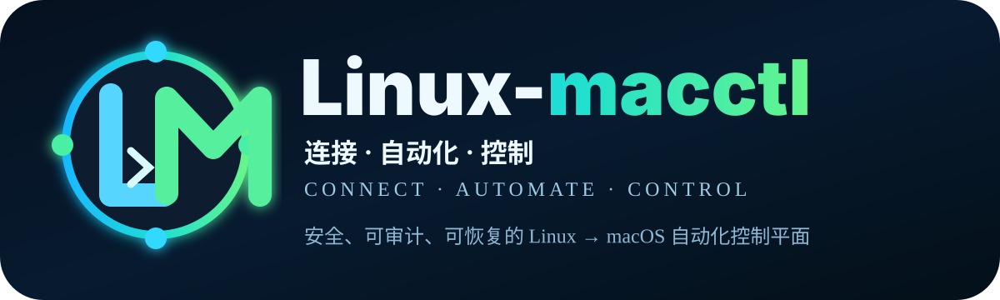
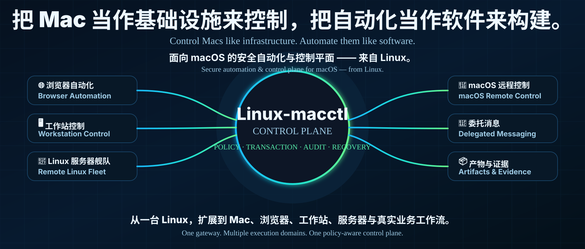
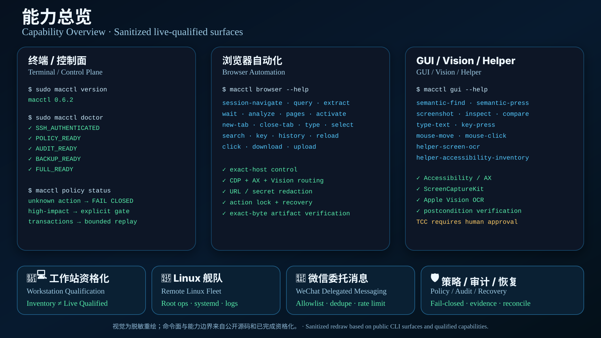
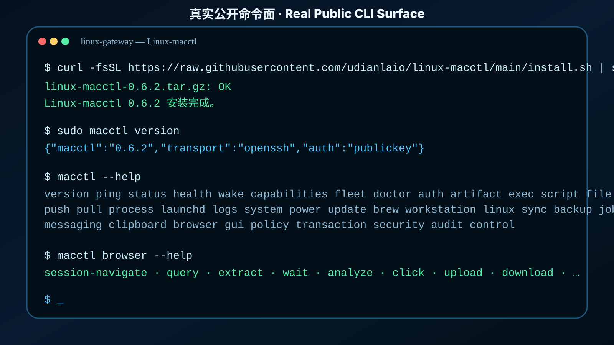
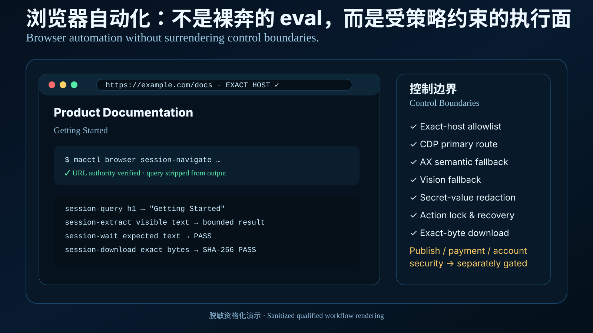
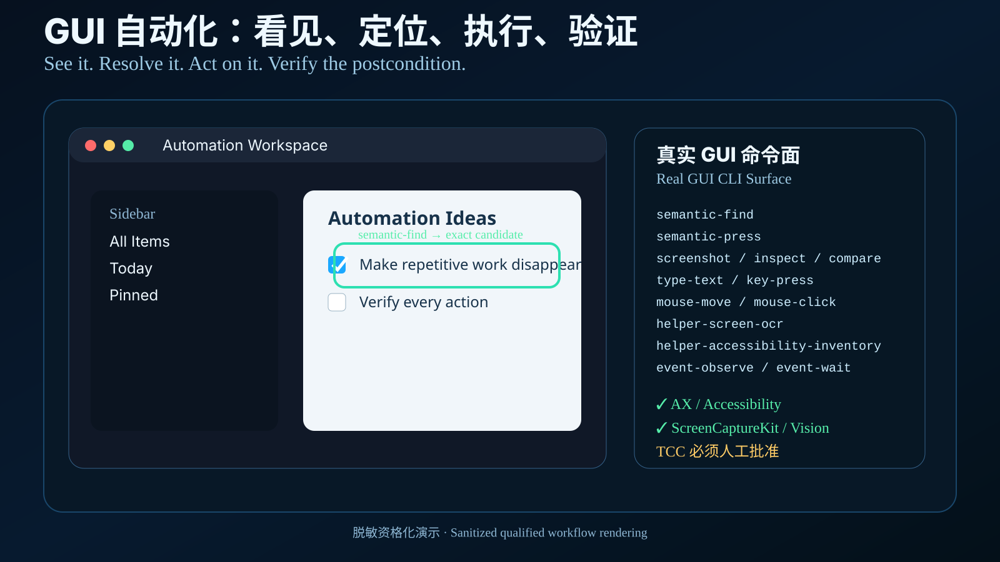

<div align="center">



<br>



<br>

# Linux-macctl

## 把 Mac 当作基础设施来控制，把自动化当作软件来构建。
### Control Macs like infrastructure. Automate them like software.

**面向 macOS 的安全自动化、浏览器控制、工作站编排、远程 Linux 舰队、委托消息、产物完整性与恢复控制平面 —— 从 Linux 出发。**
**A security-first automation and control plane for macOS, browsers, workstations, remote Linux fleets, delegated messaging, artifact integrity, and recovery — from Linux.**

<p>
  <a href="https://github.com/udianlaio/linux-macctl/releases/latest"></a>
  <a href="https://github.com/udianlaio/linux-macctl/actions/workflows/ci.yml"></a>
  <a href="https://github.com/udianlaio/linux-macctl/blob/main/LICENSE"></a>
</p>

<p>
  <a href="https://github.com/udianlaio/linux-macctl/stargazers"></a>
  <a href="https://github.com/udianlaio/linux-macctl/releases"></a>
  
  
  
  
</p>

**[⚡ 一键安装](#quick-start) · [🚀 为什么是 Linux-macctl](#why) · [✨ 能力全景](#capabilities) · [🎬 Demo](#demo) · [🏗 架构](#architecture) · [🛡 安全](#security) · [🧭 Roadmap](#roadmap) · [🤝 社区](#community)**

</div>

---

<a id="why"></a>

# 🚀 为什么是 Linux-macctl
## Why Linux-macctl

很多工具可以远程登录一台 Mac。

**Linux-macctl 想解决的不是“能不能连上”，而是“能不能把一台 Mac 变成长期可被自动化系统可靠管理的计算节点”。**

Many tools can remotely log into a Mac.

**Linux-macctl is built for a harder question: can a Mac become a long-lived, policy-aware, auditable, recoverable compute target for automation?**

这两件事之间，差的不是一条 SSH 命令，而是一整个控制平面：

The gap is not another SSH command. It is an entire control plane:

- **目标身份 / Target identity**：你到底在控制哪台机器？
- **信任链 / Trust chain**：第一次连接是不是被中间人替换了？
- **策略 / Policy**：这个动作是只读、可逆、高影响，还是应该硬阻断？
- **事务 / Transaction**：重复调用会不会再执行一次？
- **证据 / Evidence**：怎么证明“真的成功了”？
- **审计 / Audit**：动作是否可追踪、可验证、又不泄露正文和密钥？
- **恢复 / Recovery**：执行过程中断、掉线、崩溃、睡眠、重启以后怎么办？
- **多目标 / Fleet**：第二台、第三台、几十台设备如何不互相继承错误信任？

Linux-macctl 从这些最难、最容易“看起来成功但其实不可靠”的地方开始做。

Linux-macctl starts where automation usually becomes fragile: identity, policy, evidence, recovery, and multi-target isolation.

> [!IMPORTANT]
> **Linux-macctl 不是又一个 SSH wrapper，也不是一堆散落的 shell 脚本。它是一套把远程执行、GUI、浏览器、工作站、服务器、消息与产物统一到 Policy / Transaction / Audit / Recovery 模型中的控制平面。**
>
> **Linux-macctl is not “yet another SSH wrapper.” It unifies remote execution, GUI, browsers, workstations, servers, messaging, and artifacts under a policy-aware execution model.**

---

## 🌌 我们想做的东西更大
### The ambition is bigger than remote control

今天，它可以从 Linux 控制一台 Mac。

Today, it can control a Mac from Linux.

但这个项目真正想走向的是：

The long-term direction is broader:

```text
一台 Linux Gateway
    ↓
统一身份与信任
    ↓
Policy / Transaction / Audit / Recovery
    ↓
Mac / Browser / Workstation / Linux Fleet / Messaging / Artifact
    ↓
可组合工作流
    ↓
从“远程操作”升级到“自动化运行平台”
```

```text
One Linux gateway
    ↓
Identity & trust
    ↓
Policy / Transaction / Audit / Recovery
    ↓
Mac / Browser / Workstation / Linux Fleet / Messaging / Artifact
    ↓
Composable workflows
    ↓
From remote control to an automation operating layer
```

我们的目标不是让 Agent 拿到“无限权限”。

**我们的目标是：让它在明确边界里，可靠地完成越来越复杂的事情。**

The goal is not unlimited agent authority.

**The goal is reliable automation inside explicit, inspectable boundaries.**

---

## 🧠 这不是“脚本集合”，而是一套工程方法
### Not a script collection — an engineering model

<table>
<tr>
<td width="25%" valign="top">
<h3>🛡 默认安全</h3>
<p>固定 SSH host-key、显式目标身份、高影响动作独立 gate、未知动作 fail-closed。</p>
<p><b>Secure by default</b><br>Explicit identity, pinned trust, bounded authority, fail-closed unknowns.</p>
</td>
<td width="25%" valign="top">
<h3>🧾 证据优先</h3>
<p>“命令返回 0”不自动等于成功；结果需要 postcondition、exact-byte 或 live evidence。</p>
<p><b>Evidence over assumptions</b><br>Return code alone is not enough. Prove the result.</p>
</td>
<td width="25%" valign="top">
<h3>🔁 恢复是一等公民</h3>
<p>掉线、崩溃、睡眠、重启、stale socket、重复调用都进入状态机，而不是靠人工猜。</p>
<p><b>Recovery-first</b><br>Failure and reconnection are part of execution, not edge cases.</p>
</td>
<td width="25%" valign="top">
<h3>🧩 一个控制面</h3>
<p>Mac、Browser、Linux Fleet、Messaging、Artifact 共用目标、策略、事务与审计模型。</p>
<p><b>One control plane</b><br>Different domains, one execution philosophy.</p>
</td>
</tr>
</table>

---

<a id="quick-start"></a>

# ⚡ 一键安装
## Quick Start

### 1. 一条命令安装当前公开稳定版
### 1. Install the current public stable release with one command

```bash
curl -fsSL https://raw.githubusercontent.com/udianlaio/linux-macctl/main/install.sh | sudo bash
```

安装器会完成：

The installer will:

- 下载当前稳定版 GitHub Release；
- download the current stable GitHub Release;
- 校验 `SHA-256` 后才解包；
- verify `SHA-256` before extraction;
- 安装到 `/opt/macctl`；
- install to `/opt/macctl`;
- 初始化 `/etc/macctl`、状态和审计目录；
- initialize config, state, and audit directories;
- 生成独立 Ed25519 SSH client key；
- generate a dedicated Ed25519 SSH client key;
- 安装 `macctl` / `macctl-setup` / `macctl-upgrade` / `macctl-uninstall`；
- install the CLI and lifecycle helpers;
- 可选进入首次 Mac 配对向导。
- optionally start the first Mac pairing flow.

只安装、不立即配对：

Install only, pair later:

```bash
curl -fsSL https://raw.githubusercontent.com/udianlaio/linux-macctl/main/install.sh | sudo bash -s -- --no-pair
sudo macctl-setup
```

### 2. 在 Mac 上开启 Remote Login
### 2. Enable Remote Login on the Mac

macOS：

macOS:

**系统设置 → 通用 → 共享 → 远程登录**
**System Settings → General → Sharing → Remote Login**

首次建立信任时，必须在 Mac 本机独立核对 SSH host-key fingerprint。

On first trust establishment, verify the SSH host-key fingerprint independently on the Mac.

Linux-macctl **不会**：

Linux-macctl **will not**:

- 自动 `accept-new`；
- auto-accept a first-seen host key;
- 使用 `StrictHostKeyChecking=no`；
- disable strict host-key verification;
- 把“网络里出现的机器”自动当成可信目标。
- trust a target merely because it appears on the network.

### 3. 看看控制平面是否准备好
### 3. Check readiness

```bash
sudo macctl version
sudo macctl ping
sudo macctl auth --fresh
sudo macctl status
sudo macctl doctor
```

升级：

Upgrade:

```bash
sudo macctl-upgrade
```

卸载：

Uninstall:

```bash
sudo macctl-uninstall
```

默认卸载保留配置、状态与 SSH key，便于恢复；只有显式 `--purge` 才清理本机运行数据。

The default uninstall preserves local configuration, state, and SSH keys for recovery; `--purge` is explicit.

> [!NOTE]
> **一键安装解决的是 Linux gateway。完整 macOS GUI 自动化仍需要在 Mac 上部署 Helper，并由用户手工批准 Accessibility、Screen Recording、Automation 等 TCC 权限。**
>
> **The one-command installer provisions the Linux gateway. Full macOS GUI automation still requires the Helper and human-approved TCC permissions on the Mac.**

完整安装说明：[`docs/INSTALL.md`](docs/INSTALL.md)

Full installation guide: [`docs/INSTALL.md`](docs/INSTALL.md)

---

<a id="demo"></a>

# 🎬 视觉与真实命令演示
## Visual Tour & Real CLI Surfaces



上面的能力总览图是**脱敏重绘**，不是把开发环境私有截图直接公开。

The capability showcase above is a **sanitized redraw**, not a raw screenshot of a private development environment.

它的命令面来自公开源码，能力边界来自已经完成的资格化；下面三张 Demo 图进一步把真实公开 CLI surface 分开展示。

Its CLI surfaces come from the public source tree, while capability boundaries reflect completed qualification. The demos below show the public execution surfaces in more detail.

## 终端 / Terminal



## 浏览器 / Browser



## GUI / Vision / Helper



> [!NOTE]
> README 里的视觉图负责解释产品与工作流；真正的 PASS 仍以代码、测试、Release digest、postcondition 和 live qualification 为准。
>
> Visuals explain the product. PASS claims remain grounded in code, tests, release digests, postconditions, and live qualification.

---

<a id="capabilities"></a>

# ✨ 能力全景
## Capability Map

Linux-macctl 当前已经跨越了九个执行域。

Linux-macctl currently spans nine execution domains.

| # | 能力域 | Capability Domain | 状态 |
|---:|---|---|---:|
| 1 | macOS 远程系统控制 | macOS Remote System Control | ✅ Available |
| 2 | macOS 原生 GUI / Vision | Native GUI / Vision | ✅ Available |
| 3 | 浏览器自动化引擎 | Browser Automation Engine | ✅ Available |
| 4 | 生产工作站资格化 | Production Workstation Qualification | ✅ Available |
| 5 | Multi-Mac 控制平面 | Multi-Mac Control Plane | ✅ Control Plane |
| 6 | 远程 Linux 舰队 / Root Ops | Remote Linux Fleet / Root Ops | ✅ Available |
| 7 | 微信委托消息 | WeChat Delegated Messaging | ✅ Bounded |
| 8 | Artifact / Attachment 完整性 | Artifact / Attachment Integrity | ✅ Available |
| 9 | Lifecycle / Recovery | Lifecycle / Recovery | ✅ Available |

---

## 1. 🍎 macOS 远程系统控制
### macOS Remote System Control

把一台 Mac 从“需要人坐在旁边维护的桌面设备”，变成 Linux gateway 可管理的受控 target。

Turn a Mac from a manually maintained desktop into a managed target behind a Linux gateway.

当前公开控制面包括：

Current public surfaces include:

- 文件读取、写入、复制、移动、删除、stat、SHA-256；
- file read/write/copy/move/delete/stat/SHA-256;
- Linux ↔ Mac 文件 push / pull；
- Linux ↔ Mac push / pull;
- regular-file atomic finalization；
- regular-file atomic finalization;
- 进程 inventory / signal / bounded terminate；
- process inventory, signals, bounded termination;
- `launchd` 状态与受控服务动作；
- `launchd` status and controlled service actions;
- Unified Logging / 系统日志；
- Unified Logging and system logs;
- 系统、存储、网络、DNS、路由诊断；
- system, storage, network, DNS, and route diagnostics;
- session / login / power readiness；
- session, login, and power readiness;
- bounded exec / script；
- bounded command and script execution;
- timeout 后 descendant cleanup；
- descendant cleanup after timeout;
- transaction precondition / postcondition；
- transaction preconditions and postconditions;
- target-scoped audit / state。
- target-scoped audit and state.

它不是把 `ssh host sudo ...` 包一层漂亮 CLI 就结束。

It is not a pretty wrapper around `ssh host sudo ...`.

它真正关心的是：**目标是不是正确的、动作是否允许、执行是否有界、结果能否证明、失败后能不能恢复。**

It cares whether the target is correct, the action is permitted, execution is bounded, the result is provable, and recovery is possible.

---

## 2. 🖥 macOS 原生 GUI / Vision 自动化
### Native macOS GUI / Vision Automation

当纯 SSH 走到边界，Linux-macctl 可以进入原生 GUI 控制域。

When SSH reaches its boundary, Linux-macctl can move into native GUI automation.

公开 CLI 真实包含：

The public CLI exposes:

```text
semantic-find
semantic-press
screenshot
inspect
compare
event-observe
event-wait
type-text
key-press
mouse-move
mouse-click
helper-screen-ocr
helper-accessibility-inventory
helper-frontmost
helper-automation-test
helper-systemevents-test
helper-accessibility-test
```

底层组合：

Underlying primitives:

- Accessibility / AX；
- Accessibility / AX;
- ScreenCaptureKit；
- ScreenCaptureKit;
- Apple Vision OCR；
- Apple Vision OCR;
- 鼠标 / 键盘；
- mouse and keyboard;
- Unicode / 中文 / emoji 输入；
- Unicode / Chinese / emoji input;
- NSPasteboard；
- NSPasteboard;
- Finder / System Events Automation；
- Finder / System Events Automation;
- selector ranking；
- selector ranking;
- visual postcondition。
- visual postconditions.

Linux-macctl 的 GUI 原则不是“看到差不多就点”。

The GUI rule is not “click something that looks close enough.”

**目标不唯一时，宁可失败，也不猜。**

**If the target is ambiguous, fail instead of guessing.**

---

## 3. 🌐 浏览器自动化引擎
### Browser Automation Engine

很多浏览器自动化项目的默认姿势是：给脚本一个页面，然后让它随便 `eval()`。

Many browser automation systems begin with arbitrary page evaluation.

Linux-macctl 走的是另一条路：

Linux-macctl takes a different route:

**先把 URL authority、session、host scope、动作类型、secret redaction、crash recovery 做成控制合同，再谈 click/type。**

**Establish URL authority, session identity, host scope, action classification, secret redaction, and crash recovery before granting interaction primitives.**

公开 Browser CLI 包含：

The public Browser CLI includes:

```text
cdp-plan
cdp-smoke
control-plan
qualification-plan
url-check
session-start
session-list
session-status
session-stop
session-navigate
session-query
session-extract
session-wait
session-analyze
session-pages
session-activate
session-new-tab
session-close-tab
session-type
session-select
session-search
session-key
session-history
session-reload
session-click
session-download
session-upload
```

以及 native authenticated-site contract：

And a native authenticated-site contract:

```text
native-action-plan
native-action-begin
native-action-status
native-action-observe
native-action-type
native-action-click
native-action-key
native-action-finish
native-action-recovery-plan
native-action-recovery-observe
native-action-recover-interrupted
```

控制路径可以按场景路由：

Control routes are scenario-aware:

```text
Chrome isolated session
  → CDP / DOM primary
  → AX semantic fallback
  → ScreenCaptureKit + Vision fallback

Existing authenticated Chrome / Safari
  → AX semantic / native GUI
  → ScreenCaptureKit + Vision
  → default-profile CDP is not assumed safe
```

安全边界包括：

Security boundaries include:

- exact-host allowlist；
- exact-host allowlists;
- URL query / fragment 输出脱敏；
- URL query / fragment redaction;
- password / hidden / credential-like DOM value 不回传；
- password / hidden / credential-like values are not returned;
- raw arbitrary Runtime.evaluate 不作为通用 CLI；
- arbitrary raw Runtime.evaluate is not a generic CLI surface;
- Publish / Payment / Account Security 不自动继承浏览器权限；
- Publish / Payment / Account Security do not inherit generic browser authority;
- action lock / site single-flight；
- action locks and site single-flight;
- write-ahead mutation intent；
- write-ahead mutation intent;
- crash / orphan → reconcile required；
- crash/orphan → reconcile required;
- exact-byte download verification。
- exact-byte download verification.

---

## 4. 🧑‍💻 生产工作站资格化
### Production Workstation Qualification

“机器里装了 Python / Node / Docker”不等于“这台机器已经是可交付的生产工作站”。

“Python / Node / Docker exists” does not mean “production workstation qualified.”

Linux-macctl 把 inventory 和 live qualification 分开。

Linux-macctl separates inventory from live qualification.

公开工作站 surface：

Public workstation surfaces:

```text
profile
inventory
doctor
qualification-plan
qualification
```

已经覆盖的工具链方向包括：

Qualified toolchain directions include:

- C / C++；
- Swift；
- Python；
- Node.js；
- Go；
- Rust；
- Java / Maven；
- CMake / Ninja；
- Git；
- Docker / Colima；
- VS Code GUI；
- artifact exact round-trip。

资格化的核心思想：

Qualification principle:

> **存在 ≠ 可用，能启动 ≠ 可交付，可交付 ≠ 已验证。**
>
> **Installed ≠ usable. Launchable ≠ deliverable. Deliverable ≠ verified.**

---

## 5. 🧭 Multi-Mac 控制平面
### Multi-Mac Control Plane

Linux-macctl 的目标模型不是把所有 Mac 塞进同一份隐式配置。

The target model does not collapse every Mac into one implicit configuration.

每个 target 都应该拥有独立的：

Each target should have independent:

- identity；
- host key；
- credential reference；
- health；
- qualification；
- evidence；
- transaction namespace；
- audit namespace。

Fleet surface 包括：

Fleet surfaces include:

```text
fleet list
fleet status
fleet doctor
fleet resolve
fleet plan
```

并支持：

And supports:

- metadata / tags；
- provider / environment / role-like grouping；
- cross-target replay protection；
- unknown target fail-closed；
- 独立 target readiness。
- independent target readiness.

**重要：新设备不会自动继承旧设备信任。**

**Important: a new device does not inherit trust from an existing device.**

---

## 6. 🐧 远程 Linux 舰队与 Root Operations
### Remote Linux Fleet & Root Operations

Linux-macctl 不只控制 Mac。

Linux-macctl is not limited to Macs.

它也可以把远程 Linux 服务器纳入同一套受控执行思想。

Remote Linux servers can enter the same execution philosophy.

公开 `macctl linux` surface：

Public `macctl linux` surfaces:

```text
profile
list
overview
fleet-status
fleet-doctor
status
doctor
transport
qualification-plan
qualification
command
logs
package
network
process
systemd
file
```

能力包括：

Capabilities include:

- explicit target registry；
- provider / region / role / environment / tags；
- pinned host key；
- public-key transport；
- scoped root operations；
- file mutation；
- process control；
- systemd；
- journal / logs；
- package inspection；
- route / DNS / HTTPS diagnostics；
- ControlMaster / ControlPersist；
- bounded fleet concurrency；
- rate-limit-aware failure classification；
- direct primary / fallback transport model。

它让 Linux gateway 同时可以成为：

It allows the Linux gateway to become both:

**Mac control hub + Linux fleet control hub。**

**A Mac control hub and a Linux fleet control hub.**

---

## 7. 💬 微信委托消息
### WeChat Delegated Messaging

这不是“自动接管所有联系人”。

This is not “automatic authority over all contacts.”

当前 WeChat 能力被明确限制在**绑定会话**：

The WeChat capability is explicitly bounded to **bound conversations**:

```text
bind
list
observe
read
draft
send
```

控制合同包括：

Control contracts include:

- runtime contact allowlist；
- read / draft / send 独立 scope；
- exact conversation binding；
- login-state detection；
- secure draft；
- COMPOSER / HISTORY visual postcondition；
- message body 不进入 durable receipt；
- SHA-256 duplicate suppression；
- send rate-limit；
- indeterminate send recovery。

如果状态不确定，就不继续“再发一次试试”。

If send state is uncertain, the system does not blindly retry.

**先 reconcile，再决定下一步。**

**Reconcile first. Then decide.**

---

## 8. 📦 Artifact / Attachment 完整性控制平面
### Artifact / Attachment Integrity Control Plane

对自动化系统来说，“文件传到了”不够。

For automation, “the file arrived” is not enough.

还要知道：

You also need to know:

- 是不是原来的字节？
- are these the original bytes?
- 有没有被换包？
- was the artifact substituted?
- 谁可以取？
- who may retrieve it?
- 什么时候过期？
- when does it expire?
- 最终用户拿到的是不是同一个东西？
- did the end user receive the same object?

Linux-macctl 的 Artifact Core 包括：

Artifact Core includes:

- immutable snapshot；
- SHA-256 exact-byte verification；
- ACL / grant；
- TTL / GC；
- filename path stripping；
- MIME / OOXML validation；
- symlink denial；
- private-key signature detection；
- delivery session；
- idempotency / correlation；
- host receipt；
- same-reference redownload verification；
- secret-like delivery fail-closed。

**“看起来像附件”不等于“附件交付成功”。**

**“Looks like an attachment” is not the same as verified delivery.**

---

## 9. 🔁 Lifecycle / Recovery
### Lifecycle / Recovery

真正的远程控制不是“连上一次就算完成”。

Real remote control is not “connected once, done forever.”

设备会：

Machines will:

- logout；
- sleep；
- DarkWake；
- reboot；
- 网络切换；
- SSH socket stale；
- GUI session 未恢复；
- helper 未 ready；
- 浏览器动作进程 crash；
- stateful mutation 执行到一半中断。

Linux-macctl 的恢复模型覆盖：

Recovery models cover:

- stale ControlMaster socket recovery；
- bounded connect / server-alive timeout；
- login vs GUI-ready 区分；
- sleep / Wake-on-LAN；
- controlled reboot qualification；
- boot epoch；
- transport fault classification；
- browser orphan recovery；
- transaction replay / indeterminate state；
- source backup / restore drill。

一个核心原则：

One core principle:

> **HEADLESS_READY 不是 FULL_READY。网络恢复也不是业务恢复。**
>
> **HEADLESS_READY is not FULL_READY. Network recovery is not application recovery.**

---

# 💎 Linux-macctl 的“狠活”在哪里
## Where the engineering depth lives

下面这些能力不一定是 README 截图里最显眼的部分，但它们决定了一个远程自动化项目到底是“Demo”，还是能够往生产方向演进。

These capabilities may not be the flashiest screenshots, but they are what separate a demo from a production-minded control plane.

### 1. Unknown operation = fail closed

不知道是什么动作？拒绝。

Unknown action? Reject it.

### 2. Capability ≠ Authorization

能做到，不代表当前这次允许做。

Being technically possible does not imply current authorization.

### 3. Transaction identity

同一个 request 不应该因为重试就执行第二遍 stateful mutation。

A retry should not accidentally execute the same stateful mutation twice.

### 4. Precondition / postcondition

执行前验证世界仍然是预期状态；执行后验证结果真的发生。

Validate the world before execution, and validate the result afterward.

### 5. Write-ahead intent

高风险动作先记录“我要做什么”，再进入不可逆窗口。

Record mutation intent before entering the irreversible window.

### 6. Reconcile required

中断后如果无法证明“没发生”，就不能假装没发生。

If interruption prevents proving that nothing happened, the state must remain uncertain until reconciled.

### 7. Bounded output / bounded concurrency / bounded time

不能让一个远程命令吃掉无限内存、无限等待或无限并发。

A remote command must not consume unbounded memory, time, or concurrency.

### 8. Secrets stay out of durable state

密码、私钥、Token、Cookie、消息正文不应该被“顺手”写进长期日志。

Passwords, private keys, tokens, cookies, and message bodies should not leak into durable logs.

### 9. Exact bytes matter

文件传输不是 `scp rc=0` 就算成功；最终字节必须可验证。

File transfer is more than `scp rc=0`; final bytes should be verifiable.

### 10. Live qualification is separate from inventory

“看得到工具”与“这个能力已经真实验证”是两件事。

Inventory and live qualification are separate concepts.

---

<a id="architecture"></a>

# 🏗 架构
## Architecture

```text
                          AI Agent / ChatGPT / Human Operator
                                      │
                                      │ API / SentinelX / SSH / CI
                                      ▼
                    ┌───────────────────────────────────┐
                    │        Linux Gateway             │
                    │        Linux-macctl              │
                    ├───────────────────────────────────┤
                    │ Target / Fleet Registry           │
                    │ Policy Engine                     │
                    │ Transaction Engine                │
                    │ Audit Engine                      │
                    │ Doctor / Qualification            │
                    │ Browser Engine                    │
                    │ Artifact / Attachment Engine      │
                    │ Messaging Engine                  │
                    │ Recovery / Lifecycle              │
                    └──────────────┬────────────────────┘
                                   │
                  ┌────────────────┴────────────────┐
                  │                                 │
          pinned OpenSSH                     pinned OpenSSH
                  │                                 │
                  ▼                                 ▼
       ┌──────────────────────┐          ┌──────────────────────┐
       │     macOS Target     │          │  Remote Linux Fleet  │
       ├──────────────────────┤          ├──────────────────────┤
       │ OpenSSH              │          │ files / process      │
       │ MacCtl Helper        │          │ systemd / logs       │
       │ Accessibility / AX   │          │ package / network    │
       │ ScreenCaptureKit     │          │ scoped root ops      │
       │ Apple Vision         │          │ fleet transport      │
       │ Browser / Apps       │          │ target evidence      │
       └──────────────────────┘          └──────────────────────┘
```

### 请求生命周期
### Request lifecycle

```text
Request
  ↓
Target Resolution
  ↓
Policy Classification
  ↓
Authorization Gate (when required)
  ↓
Precondition
  ↓
Write-Ahead / Transaction Intent
  ↓
Bounded Execution
  ↓
Postcondition / Evidence
  ↓
Audit / Receipt
  ↓
Completed | Failed | Reconcile Required
```

这也是 Linux-macctl 和“一堆自动化命令”的本质区别。

That lifecycle is the difference between a control plane and a pile of automation commands.

---

## 🧱 信任边界
### Trust boundaries

Linux-macctl 刻意把不同权限域拆开，而不是把所有东西塞进一个 root shell。

Linux-macctl intentionally separates privilege domains instead of collapsing everything into one root shell.

| 边界 | 中文说明 | English |
|---|---|---|
| Operator / Agent | 谁提出动作 | Who proposes the action |
| Linux Gateway | 控制面运行位置 | Where the control plane runs |
| SSH Identity | 每个目标的连接身份 | Connection identity per target |
| Host Key | 远端目标身份 | Remote target identity |
| Policy | 动作允许程度 | Action authority classification |
| macOS TCC | GUI 权限由 macOS 控制 | macOS owns GUI privacy permissions |
| Helper | GUI 能力边界 | GUI capability boundary |
| Browser Session | 浏览器状态与站点范围 | Browser state and site scope |
| Artifact Store | 文件完整性与访问 | Artifact integrity and access |
| Audit | 持久证据但不保存敏感正文 | Durable evidence without sensitive payloads |

---

<a id="security"></a>

# 🛡 安全模型
## Security by Design

安全不是 README 最后一节的免责声明。

Security is not a disclaimer at the bottom of the README.

**它是 Linux-macctl 的产品设计本身。**

**It is part of the product design itself.**

| 安全项 | 默认行为 / Default |
|---|---|
| SSH Host Key | `StrictHostKeyChecking=yes` |
| First-seen trust | 不自动接受 / never auto-accepted |
| Client private key | 本机生成，不进入 Git / Release |
| Password | 交给 OpenSSH 终端，不被项目读取 |
| Unknown target | Fail closed |
| Unknown operation | Fail closed |
| High-impact mutation | 独立确认 / authorization gate |
| macOS TCC | 必须人工批准，不修改 TCC.db |
| System Update | 默认禁止 / blocked by default |
| Major OS Upgrade | 默认禁止 / blocked by default |
| Browser secret values | 默认不回传 / redacted |
| Browser default profile CDP | 不自动视为安全控制路径 |
| Messaging body | 不写入 durable receipt |
| Artifact integrity | SHA-256 exact-byte |
| Transaction replay | request-id / state-aware |
| Audit | digest chain / bounded metadata |
| Release | immutable tag / asset digest validation |

### 为什么如此保守？
### Why so conservative?

因为自动化系统最危险的错误，不一定是“报错”。

The most dangerous automation failure is not always an error.

更危险的是：

More dangerous is:

- 明明不确定，却报告成功；
- reporting success while uncertain;
- 明明目标不唯一，却猜一个；
- guessing when the target is ambiguous;
- 明明动作可能执行过，却再执行一次；
- retrying a mutation that may already have happened;
- 明明是高影响动作，却因为“上一步授权过”就默认继承；
- inheriting high-impact authority from unrelated prior approval;
- 明明是秘密，却因为方便调试被写进日志。
- logging secrets “for debugging convenience.”

Linux-macctl 的回答是：

Linux-macctl's answer is:

**不确定，就把“不确定”作为一个正式状态。**

**Uncertainty is a first-class state.**

---

# 📊 当前能力状态
## Current Capability Status

| Domain | 中文状态 | English Status | 备注 |
|---|---:|---:|---|
| Linux → macOS pinned SSH | ✅ 可用 | ✅ Available | 独立 host-key trust |
| macOS file / process / logs / system | ✅ 可用 | ✅ Available | 高影响动作独立 gate |
| Mac GUI / AX / Vision | ✅ 可用 | ✅ Available | 需要 TCC 人工批准 |
| Browser isolated Chrome | ✅ 可用 | ✅ Available | CDP + exact-host |
| Existing Chrome / Safari native route | ✅ 有界 | ✅ Bounded | AX / Vision route |
| Workstation qualification | ✅ 可用 | ✅ Available | inventory ≠ qualification |
| Multi-Mac control plane | ✅ 控制面 | ✅ Control Plane | 新 target 独立建信任 |
| Remote Linux fleet / root ops | ✅ 可用 | ✅ Available | scoped root |
| WeChat delegated messaging | ✅ 有界 | ✅ Bounded | 绑定会话范围 |
| Artifact / attachment | ✅ 可用 | ✅ Available | exact bytes / receipt |
| Logout / sleep / WOL / reboot recovery | ✅ 模型可用 | ✅ Available Model | 依赖现场条件 |
| Feishu adapter | 🧪 Deferred | 🧪 Deferred | 当前不宣称支持 |
| Windows native control | 🧪 Deferred | 🧪 Deferred | 当前不宣称支持 |
| Physical Ethernet ↔ Wi-Fi failover | ⚠️ 环境相关 | ⚠️ Environment-specific | 不做泛化 PASS |
| Cold-power / OOB | ➖ 不在范围 | ➖ Out of Scope | 需要独立硬件/OOB |

---

# 🧪 真实工程验证
## Engineering Validation

公开发行版不是“打个 tar.gz 就上线”。

The public release process is more than “create a tarball and upload it.”

当前公开仓库持续执行：

The public repository continuously validates:

- public privacy scan；
- shell syntax；
- Python compileall；
- deterministic unit / contract tests；
- one-command installer behavior；
- release package determinism；
- release artifact SHA-256；
- Apache-2.0 LICENSE inclusion；
- immutable GitHub Release；
- anonymous public installation path。

当前公开 deterministic suite：**322 tests**。

Current public deterministic suite: **322 tests**.

公开 CI：[`public-ci`](https://github.com/udianlaio/linux-macctl/actions)

Public CI: [`public-ci`](https://github.com/udianlaio/linux-macctl/actions)

当前公开稳定版：**v0.6.2**。

Current public stable release: **v0.6.2**.

---

# 📦 Release Engineering
## Release Engineering

正式公开 Release 坚持：

Public releases follow:

1. clean worktree；
2. privacy scan；
3. deterministic tests；
4. release commit freeze；
5. deterministic package x2；
6. byte-for-byte compare；
7. SHA-256 sidecar；
8. release manifest；
9. draft GitHub Release；
10. remote asset digest compare；
11. publish；
12. immutable verification；
13. anonymous installer verification。

正式 tag **不会**随着 `main` 后续提交移动。

A formal tag **does not move** with later `main` commits.

当前 Release：

Current releases:

**https://github.com/udianlaio/linux-macctl/releases**

---

# 🎯 适合什么场景
## Use Cases

## 场景 A：AI Operator 管理一台 Mac 工作站
### Scenario A: AI operator for a Mac workstation

```text
检查 readiness
→ 拉取代码
→ 构建 / 测试
→ 操作 GUI 工具
→ 浏览器验证
→ 生成 artifact
→ exact-byte 校验
→ 回传结果
```

```text
Check readiness
→ fetch code
→ build / test
→ operate GUI tools
→ browser verification
→ produce artifacts
→ exact-byte validation
→ return evidence
```

## 场景 B：浏览器生产流程
### Scenario B: Browser production workflow

```text
创建 isolated session
→ exact-host policy
→ 页面提取
→ DOM / AX / Vision route
→ action
→ postcondition
→ artifact download
→ cleanup
```

## 场景 C：多服务器运维
### Scenario C: Multi-server operations

```text
按 provider / region / role / tag 选目标
→ bounded concurrency
→ transport health
→ scoped operation
→ per-target evidence
→ fleet summary
```

## 场景 D：GUI-only 工具自动化
### Scenario D: GUI-only application automation

```text
ScreenCaptureKit
→ Vision / AX 定位
→ exact / ranked selector
→ click / type / hotkey
→ visual postcondition
→ audit
```

## 场景 E：委托消息
### Scenario E: Delegated messaging

```text
绑定会话
→ exact conversation verify
→ secure draft
→ visual composer check
→ controlled send
→ history postcondition
→ dedupe receipt
```

## 场景 F：故障恢复
### Scenario F: Recovery

```text
transport fault
→ classify
→ preserve uncertainty
→ restore transport
→ re-evaluate readiness
→ reconcile state
→ continue only when safe
```

## 场景 G：产物交付
### Scenario G: Artifact delivery

```text
producer
→ immutable artifact snapshot
→ SHA-256
→ ACL / grant
→ delivery session
→ host receipt
→ same-reference verification
```

## 场景 H：未来 Workflow Orchestration
### Scenario H: Future workflow orchestration

```text
Browser discovers information
→ Policy evaluates
→ Mac performs local work
→ Linux fleet executes server-side steps
→ Messaging reports result
→ Artifact bundle closes evidence
```

---

# 🧭 操作原则
## Operating Principles

### 01 · 能力不等于授权
### Capability is not authorization

系统具备某能力，不代表当前请求自动获得该能力的全部权限。

A capability existing does not grant universal authority to every request.

### 02 · 证据优先于猜测
### Evidence over assumptions

没有证据，不写 PASS。

No evidence, no PASS.

### 03 · Exactly one or fail
### Exactly one or fail

目标、selector、conversation、target 不唯一时拒绝猜。

Ambiguous target, selector, conversation, or device? Fail instead of guessing.

### 04 · 一切有界
### Bound everything

时间、输出、并发、TTL、重试、artifact size 都应该有边界。

Time, output, concurrency, TTL, retries, and artifact size should be bounded.

### 05 · 秘密不进入持久状态
### Secrets stay out of durable state

不要为了“调试方便”把秘密写进未来会存在很久的地方。

Do not persist secrets merely for debugging convenience.

### 06 · 恢复是执行的一部分
### Recovery is part of execution

Crash / reboot / timeout / network loss 不应该是架构之外的意外。

Crash, reboot, timeout, and network loss should be modeled, not hand-waved.

### 07 · 正式发布不可变
### Releases are immutable

修复应该发新版本，而不是覆盖历史 Release。

Fixes become new releases, not rewritten history.

---

<a id="roadmap"></a>

# 🗺 Roadmap
## Roadmap

Roadmap 是方向，不是日期承诺。

The roadmap is directional, not a date promise.

每个新增能力在进入“公开支持”之前，都应该先回答三个问题：

Before a capability becomes publicly supported, it should answer three questions:

1. 权限边界是什么？ / What is the authority boundary?
2. 失败状态如何恢复？ / How does failure recover?
3. 如何证明真的成功？ / How is success proven?

---

## v0.6.x — 公开发行、安装体验与供应链强化
### v0.6.x — Public distribution, installation UX, and supply-chain hardening

- [x] 一键公网安装 / one-command public install
- [x] clean-history public distribution
- [x] Apache-2.0
- [x] deterministic release package
- [x] immutable GitHub Release
- [x] public privacy scanner
- [x] LICENSE 内置 Release package
- [x] anonymous install verification
- [ ] Debian / Ubuntu `.deb`
- [ ] Fedora / RHEL `.rpm`
- [ ] Arch / openSUSE native packages
- [ ] SBOM
- [ ] Sigstore / stronger signed provenance
- [ ] multi-distro fresh-VM installer CI
- [ ] upgrade channel / rollback UX
- [ ] installer doctor / troubleshooting assistant
- [ ] Homebrew-like distribution metadata for Linux package managers

目标：**让安装和升级体验配得上控制面的工程质量。**

Goal: **make installation and upgrade quality match the control plane itself.**

---

## v0.7 — Workflow Orchestration
### v0.7 — Workflow Orchestration

从“我能控制这些系统”，升级到“我能可靠跑完整工作流”。

Move from “I can control these systems” to “I can reliably execute end-to-end workflows.”

计划方向：

Planned directions:

- declarative workflow / runbook；
- DAG / step dependency；
- conditional execution；
- approval gate；
- retry / timeout / compensation；
- step-level transaction；
- long-running workflow state；
- schedule / event trigger；
- Browser → Mac → Linux → Messaging 跨域编排；
- workflow-level audit；
- evidence bundle；
- reusable workflow templates；
- human-in-the-loop checkpoints。

想象一下：

Imagine:

```text
发现网页上的新版本
→ 校验来源
→ 在 Mac 上拉代码
→ 构建
→ GUI 打开客户端验证
→ Browser 跑一遍流程
→ Linux server 部署 canary
→ 收集日志和产物
→ 微信发送结果
→ 生成一份完整 evidence bundle
```

这才是 Linux-macctl 真正想去的地方。

That is the direction Linux-macctl is ultimately aiming for.

---

## v0.8 — Fleet Control Center
### v0.8 — Fleet Control Center

从“多 target 模型”继续走向真正的 fleet platform。

Evolve the multi-target model toward a real fleet platform.

- large-scale onboarding；
- device groups；
- role / environment；
- fleet policy；
- fleet health dashboard；
- configuration drift detection；
- distributed job execution；
- rollout / canary；
- bounded blast radius；
- per-target capability discovery；
- operator / agent role separation；
- stronger backup / restore；
- disaster recovery plans；
- maintenance windows；
- fleet-wide evidence aggregation。

---

## v0.9 — Cross-platform & Adapter Ecosystem
### v0.9 — Cross-platform & Adapter Ecosystem

### Windows Native Control

未来 Windows 方向不会要求“在 Windows 里先跑一台 Linux VM 再反控 Windows”。

Future Windows control will not require a Linux VM inside Windows just to control Windows again.

目标是：

Target model:

```text
Windows Native Target
├─ PowerShell
├─ Services
├─ Processes
├─ Filesystem
├─ Registry
├─ Event Log
├─ Scheduled Tasks
├─ Windows UI Automation
├─ GPU / Local Model workflows
└─ WSL2 (optional Linux execution domain)
```

WSL2 是 Windows target 下的辅助执行域，而不是主控制路径。

WSL2 is an auxiliary Linux execution domain under the Windows target, not the primary Windows control path.

其他方向：

Other directions:

- Feishu delegated messaging adapter；
- more browser adapters；
- more application adapters；
- pluggable transports；
- pluggable notification backends；
- external artifact backends；
- cloud control integrations。

---

## Toward v1.0 — 开放自动化平台
### Toward v1.0 — Open Automation Platform

如果 v0.6 是“控制面成形”，v1.0 希望是“平台成形”。

If v0.6 establishes the control plane, v1.0 aims to establish the platform.

- stable public API；
- compatibility contract；
- extension / adapter SDK；
- signed extension packages；
- policy packs；
- reusable workflow marketplace；
- RBAC / multi-operator；
- secret-provider integration；
- stronger observability；
- distributed runners；
- tenant / environment isolation；
- organization policy integration；
- extensible evidence format；
- ecosystem documentation and examples。

**目标不是做“一个更大的脚本”。**

**The goal is not a bigger script.**

**目标是做一个真正能让 AI、自动化系统和人类运维者共同使用的开放控制平面。**

**The goal is an open control plane where AI agents, automation systems, and human operators can work together.**

---

# 🚧 明确不吹的地方
## Explicit Non-Claims

项目可以有气势，但不能靠把未完成的东西写成已经支持来显得强。

A project can be ambitious without pretending unfinished features already exist.

当前明确不做泛化宣称：

Current non-claims include:

- 任意 authenticated website unrestricted automation；
- unrestricted automation of arbitrary authenticated websites;
- browser network/subresource egress containment as a universal sandbox；
- universal browser subresource egress sandboxing;
- Feishu live qualification；
- Feishu live qualification;
- Windows native control；
- Windows native control;
- arbitrary physical Ethernet ↔ Wi-Fi failover；
- universal physical Ethernet ↔ Wi-Fi failover;
- cold-power / OOB without dedicated hardware；
- cold-power / OOB without dedicated hardware;
- automatic macOS TCC bypass；
- automatic macOS TCC bypass;
- CAPTCHA / Passkey / WebAuthn bypass；
- CAPTCHA / Passkey / WebAuthn bypass;
- automatic expansion from one approved messaging contact to all contacts。
- automatic messaging scope expansion.

**强大，不等于边界模糊。**

**Power does not require vague boundaries.**

---

# 🔒 Privacy & Public Provenance
## 隐私与公开来源

这部分放在 README 后面，而不是拿来当第一句自我介绍。

This belongs near the end of the README, not as the product's opening sentence.

公开仓库使用独立 clean history，避免把内部工程历史里的现场痕迹直接暴露出去。

The public repository uses a clean history so internal qualification history and environment-specific traces are not exposed by default.

公开源码与 Release 不包含：

Public source and releases do not include:

- 开发者真实主机配置；
- developer-specific host configuration;
- SSH private key；
- SSH private keys;
- Token / Cookie；
- tokens or cookies;
- 私有联系人；
- private contacts;
- 私有 LAN / 云主机拓扑；
- private LAN or cloud topology;
- Keychain / TCC database；
- Keychain / TCC databases;
- runtime `/etc/macctl`；
- runtime `/etc/macctl` data;
- runtime audit / transaction state；
- runtime audit / transaction state;
- 内部 qualification evidence raw files。
- raw internal qualification evidence.

公开来源关系：[`PUBLIC_PROVENANCE.json`](PUBLIC_PROVENANCE.json)

Public provenance: [`PUBLIC_PROVENANCE.json`](PUBLIC_PROVENANCE.json)

---

# ❓ FAQ
## Frequently Asked Questions

<details>
<summary><b>Linux-macctl 是远程桌面软件吗？ / Is Linux-macctl a remote desktop app?</b></summary>
<br>
不是。远程桌面主要解决“人看到屏幕然后操作”。Linux-macctl 更接近自动化控制平面：目标、策略、事务、证据、审计、恢复是核心概念。GUI 只是执行域之一。
<br><br>
No. Remote desktop focuses on a human viewing and operating a screen. Linux-macctl is closer to an automation control plane where targets, policy, transactions, evidence, audit, and recovery are first-class concepts.
</details>

<details>
<summary><b>必须用 ChatGPT 或 SentinelX 吗？ / Does it require ChatGPT or SentinelX?</b></summary>
<br>
不必须。`macctl` 本身是 Linux 上的控制 CLI。ChatGPT、SentinelX、其他 Agent、CI、脚本或人工终端都可以作为上层调用者。
<br><br>
No. `macctl` is a Linux-side control CLI. ChatGPT, SentinelX, other agents, CI systems, scripts, or human operators can sit above it.
</details>

<details>
<summary><b>会保存我的 Mac 密码吗？ / Does it store my Mac password?</b></summary>
<br>
不会。首次公钥投递需要密码时，密码交给 OpenSSH 的终端提示，Linux-macctl 不读取、不持久化密码。
<br><br>
No. Password entry is handled by OpenSSH's terminal prompt. Linux-macctl does not read or persist the password.
</details>

<details>
<summary><b>为什么不自动接受 SSH host key？ / Why not auto-accept SSH host keys?</b></summary>
<br>
因为第一次连接就是最需要验证目标身份的时候。自动接受 first-seen key 会把“第一次看到”错误地等价成“可信”。
<br><br>
Because first contact is exactly when target identity matters most. “First seen” must not silently become “trusted.”
</details>

<details>
<summary><b>能自动授予 macOS Accessibility / Screen Recording 吗？</b></summary>
<br>
不能，也不会绕过。TCC 权限由用户在 macOS 系统界面中批准。
<br><br>
No. TCC permissions remain under macOS and require human approval.
</details>

<details>
<summary><b>能控制多台 Mac 吗？ / Can it control multiple Macs?</b></summary>
<br>
控制平面已经具备多 target / fleet 模型。每台新 Mac 都需要独立建立 identity、host-key trust 和 readiness，不能继承另一台设备的可信状态。
<br><br>
The control plane supports a multi-target model. Each Mac needs independent identity, host-key trust, and readiness.
</details>

<details>
<summary><b>能控制 Linux 服务器吗？ / Can it control Linux servers?</b></summary>
<br>
可以。公开版本包含 Remote Linux target registry、fleet status/doctor、command、logs、package、network、process、systemd、file 和 scoped root operations。
<br><br>
Yes. The public tree includes remote Linux registry, fleet status/doctor, commands, logs, packages, networking, processes, systemd, files, and scoped root operations.
</details>

<details>
<summary><b>浏览器是不是可以随便控制任何网站？ / Can browser automation control any site without restrictions?</b></summary>
<br>
不是。Browser Engine 强调 exact-host、session、动作类型和 site-specific mutation scope。高影响站点动作不会因为“浏览器可控”而自动授权。
<br><br>
No. Browser automation is scoped by host, session, action type, and site-specific mutation contracts. Browser access does not imply unrestricted site authority.
</details>

<details>
<summary><b>微信会自动给所有联系人发消息吗？ / Can WeChat messaging send to everyone automatically?</b></summary>
<br>
不会。当前能力按绑定会话工作，read/draft/send 权限分离，并有 duplicate suppression 与 rate limit。
<br><br>
No. Current messaging is conversation-bound, with separate read/draft/send scopes, duplicate suppression, and rate limiting.
</details>

<details>
<summary><b>Windows 呢？ / What about Windows?</b></summary>
<br>
Windows Native Control 在 Roadmap 中，但当前版本不宣称支持。未来方向是直接做 Windows Native control，WSL2 作为可选辅助执行域。
<br><br>
Windows Native Control is on the roadmap but not currently claimed. The intended design is native Windows control with WSL2 as an optional auxiliary execution domain.
</details>

<details>
<summary><b>为什么 README 里的 Demo 图不是直接贴私有测试截图？</b></summary>
<br>
因为真实内部资格化截图可能包含主机名、网络、联系人或其他运行环境痕迹。这里采用脱敏重绘，同时公开真实 CLI surface 和能力边界。
<br><br>
Because raw internal screenshots may contain environment-specific identifiers. The README uses sanitized redraws while keeping the public CLI surfaces and capability claims verifiable in source.
</details>

<details>
<summary><b>适合拿来做 AI Agent 的执行层吗？ / Is it suitable as an execution layer for AI agents?</b></summary>
<br>
这正是主要设计方向之一：让上层 Agent 不必直接持有一堆无边界 root shell，而是通过 target、policy、transaction、evidence 和 recovery 模型执行动作。
<br><br>
Yes — that is one of the core design directions: place a bounded control plane between an agent and high-capability execution domains.
</details>

---

<a id="community"></a>

# 🤝 社区与贡献
## Community & Contributing

欢迎：

Welcome:

- Bug report；
- Feature request；
- README / docs 改进；
- 新 Linux 发行版适配；
- 新 Browser / App adapter；
- Policy contract 提案；
- Recovery model 改进；
- 新测试 fixture；
- packaging / SBOM / provenance；
- observability；
- workflow ideas。

Issue：
https://github.com/udianlaio/linux-macctl/issues

Pull Requests：
https://github.com/udianlaio/linux-macctl/pulls

大型能力建议最好先讨论：

For large features, discuss first:

1. authority boundary；
2. fail-closed behavior；
3. recovery state；
4. test contract；
5. privacy / secret handling；
6. live qualification plan。

如果这个项目让你觉得“原来 Mac 自动化还能这样做”，欢迎给一个 ⭐。

If this project makes you think “Mac automation can be engineered like this,” consider leaving a ⭐.

它会帮助更多需要 **AI + macOS + Linux + Browser + Fleet Automation** 的人发现这个项目。

It helps more builders working on **AI + macOS + Linux + Browser + Fleet Automation** discover the project.

---

# 📄 License
## 开源许可证

Linux-macctl 使用 **Apache License 2.0**。

Linux-macctl is licensed under the **Apache License 2.0**.

它允许个人和企业自由使用、修改、分发和商业使用，同时提供明确的专利授权与专利争议终止条款。

It permits commercial and private use, modification, and distribution, while providing explicit patent grants and patent-termination terms.

完整条款：[`LICENSE`](LICENSE)

Full license: [`LICENSE`](LICENSE)

---

<div align="center">


## 更强大的自动化，不应该意味着更模糊的控制边界。
### More powerful automation should not mean less explicit control.

**连接 · 自动化 · 控制**
**Connect · Automate · Control**

**Linux → macOS · Browser · Workstation · Fleet · Messaging · Artifact · Policy · Audit · Recovery**

<br>

**⭐ Star the repo · 🔧 Build adapters · 🧠 Bring your agent · 🚀 Automate responsibly**

</div>
